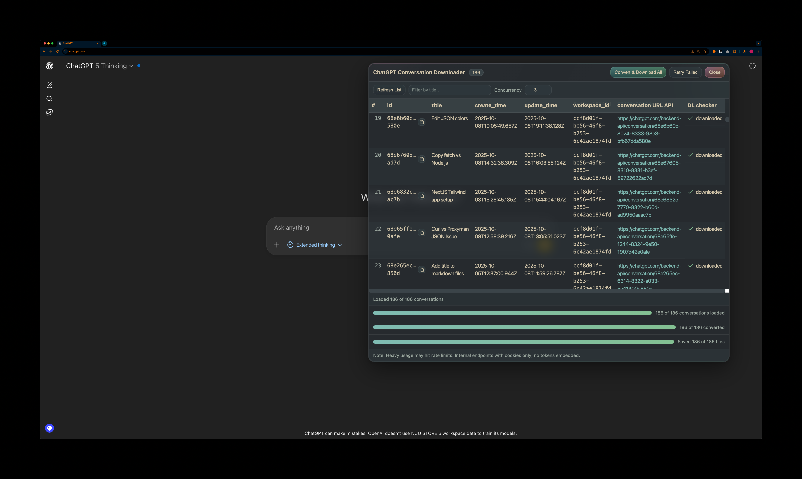

# ChatGPT Conversations Exporter

Export your ChatGPT conversations straight from the browser into clean Markdown files, including chats stored inside your ChatGPT Project (Gizmo) folders. This runs entirely client‑side inside the ChatGPT web app via your browser console — no server, no tokens.

## What it does

- Lists your conversations using ChatGPT’s in‑page APIs (with your existing session cookies)
- Shows metadata: title, created/updated timestamps, workspace id, project id/name, and the conversation API link
- Pulls in ChatGPT “Projects” (aka Gizmos) you own and merges their conversations into the list
- Converts each conversation JSON to readable Markdown
- Saves files with stable names like `YYYY-MM-DD-title.md`
- Persists download status locally so you don’t re-download the same chats
- Handles rate limits with retries and backoff

## How to run in the browser console

1) Open ChatGPT and sign in
- https://chat.openai.com or https://chatgpt.com

2) Open Developer Tools → Console
- macOS: Cmd+Option+J (Chrome), Cmd+Option+I then Console tab
- Windows/Linux: Ctrl+Shift+J (Chrome)

3) Load and run the script

Option A — Paste the script
- Open `chatgpt-conversation-downloader.js` from this repo, copy its entire contents, and paste into the Console, then press Enter.

Note: One‑liner fetch from external origins (e.g., raw.githubusercontent.com) is blocked on ChatGPT by its Content Security Policy (connect-src), so pasting is required. The console error “Refused to connect … violates Content Security Policy” and “TypeError: Failed to fetch” are expected in this case.

The panel will appear at the bottom‑right of the page.

## Using the UI

- Refresh List: Fetches your conversations (supports paging with “Load more”) and walks every owned Project/Gizmo to gather project chats.
- Filter: Type to filter by title.
- Concurrency: Controls how many conversions/downloads run in parallel (1–5).
- Convert & Download All: Fetch details → convert to Markdown → save all files.
  - If supported, you’ll be prompted to pick a folder (File System Access API).
  - If not supported, it falls back to browser downloads via invisible anchors.
- Retry Failed: Attempts saving again only for items that previously errored.

Status indicators per row
- downloaded: File saved successfully.
- error: Hover to see the error message, then use “Retry Failed”.

File naming
- `YYYY-MM-DD-title.md` using the best available timestamp (update_time → create_time → today).
- Conversations that belong to a Project/Gizmo include the project slug: `YYYY-MM-DD-project-title.md`.

Persistence
- Download status is stored in `localStorage` and is respected on subsequent runs.

## How Markdown is generated

The converter:
- Walks the conversation graph in a consistent order
- Includes visible user/assistant/system messages
- Preserves code blocks as fenced code with language when available
- Cleans citation markers like `【…】` and simple footnotes (`[^1]`, `[1]`)
- Appends a “Sources” section from collected safe URLs and links found in messages

## Supported sites

- chat.openai.com and chatgpt.com (the script detects host automatically)

## Notes and limitations

- Runs with your existing session; no API keys are stored.
- Heavy usage can hit rate limits; the tool retries with backoff.
- ChatGPT UI/endpoint changes could impact functionality.

## Development

- Single, standalone file: `chatgpt-conversation-downloader.js`
- Pure browser JavaScript; no build step required
